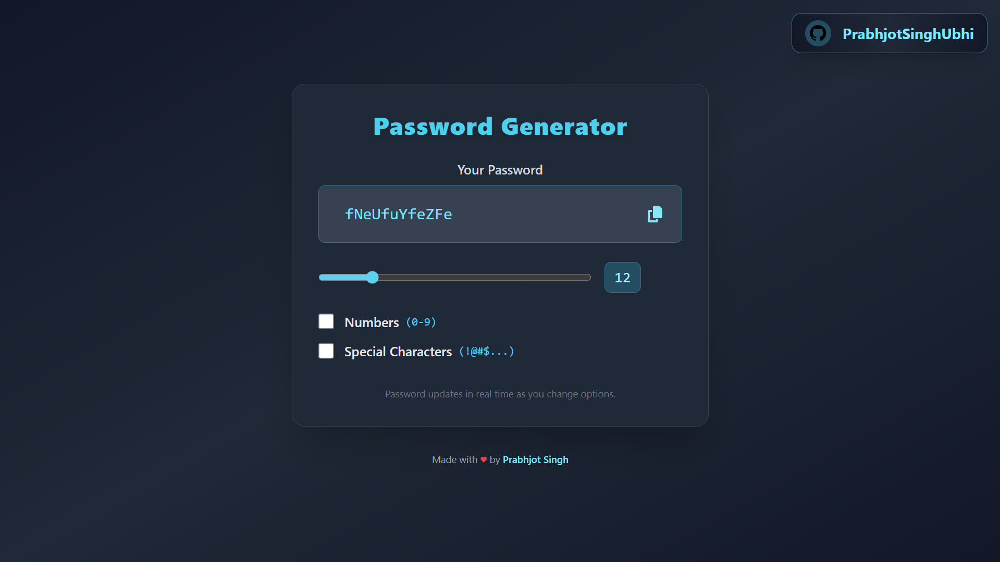

# 🔐 Random Password Generator

Welcome to your one-stop solution for creating strong, secure, and unique passwords in seconds!  
Whether you need a password for your next big project or just want to boost your online security, this app has you covered.

---

<!-- Project Link -->

🚀 **Try it now:** [Generate your passwords instantly!](https://random-password-generator-eight-zeta.vercel.app/)

<!-- Project Image -->

<p align="center">
  
</p>

---

A simple and customizable random password generator built with **React** and **Vite**.

## ✨ Features

- 🔒 **Secure:** Generates strong, random passwords every time
- 🛠️ **Customizable:** Choose uppercase, lowercase, numbers, and symbols
- 📏 **Flexible:** Set your desired password length
- 📋 **Convenient:** Copy passwords to your clipboard with one click
- 📱 **Responsive:** Works beautifully on any device

## 🚀 Getting Started

### Installation

1. **Clone the repository:**
   ```bash
   git clone https://github.com/your-username/random-password-generator.git
   cd random-password-generator
   ```

2. **Install dependencies:**
   ```bash
   npm install
   ```

### Running the App

Start the development server:
```bash
npm run dev
```
Open [http://localhost:5173](http://localhost:5173) in your browser to get started!

### Building for Production

```bash
npm run build
```

## 📝 Usage

1. Select your desired password options (length, character types).
2. Click **"Generate Password"** to create a new password.
3. Click the **"Copy"** button to copy the password to your clipboard.

## 🎨 Customization

- Change the default password length and character sets in the source code.
- Personalize the UI by editing the React components and CSS.

## 📄 License

This project is licensed under the MIT License.

---

> 💡 **Pro Tip:** Use unique passwords for every account to maximize your security!
